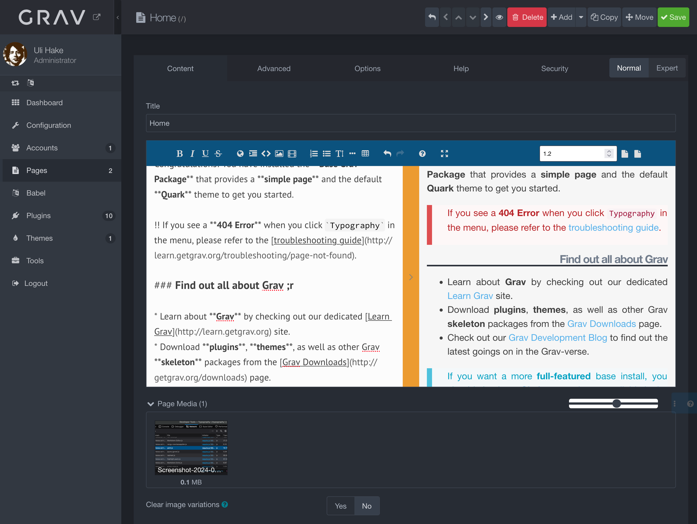

# Grav Studio Editor Plugin

**If you encounter any issues, please don't hesitate
to [report
them](https://github.com/leotiger/grav-plugin-studioeditor/issues).**

The **Studio Editor Plugin** for [Grav](http://github.com/getgrav/grav) provides an advanced markdown editor with Live preview and WYSIWYG controls and support for extended markdown features. The plugin allows to activate some nice extra features, e.g. if you use webp plugin the plugin will automatically replace calls to jpg and png files to the corresponding webp version if it exists without using redirection.

The plugin at it's current state has issues with the Flex Objects plugin. To access the Flex Objects plugin configuration you have to dissable the Studio Editor plugin and reactivate it after touching the Flex Objects configuration.

Please be advised that some of the features, like MathJax haven't been retested for this public release. This may apply to other features as well. What's definitely working out of the box is what you expect to work: editing standard and enhanced markdown.

## Installation

Installing the Studioeditor plugin can be done in one of three ways:
- GPM (Grav Package Manager)
- manual method
- admin method

### GPM Installation (Preferred)

To install the plugin via the [GPM](http://learn.getgrav.org/advanced/grav-gpm), through your system's terminal (also called the command line),
navigate to the root of your Grav-installation, and enter:

    bin/gpm install studioeditor

This will install the Studioeditor plugin into your `/user/plugins`-directory within Grav. Its files can be found under `/your/site/grav/user/plugins/studioeditor`.

### Manual Installation

To install the plugin manually, download the zip-version of this repository and unzip it under `/your/site/grav/user/plugins`.
Then rename the folder to `studioeditor`. You can find these files on [GitHub](https://github.com/leotiger/grav-plugin-studioeditor) or via [GetGrav.org](http://getgrav.org/downloads/plugins#admin).

You should now have all the plugin files under

    /your/site/grav/user/plugins/studioeditor

> NOTE: This plugin is a modular component for Grav which may require other plugins to operate,
> please see its [blueprints.yaml-file on GitHub](https://github.com/leotiger/grav-plugin-studioeditor/blob/master/blueprints.yaml).

### Admin Plugin

If you use the Admin Plugin, you can install the plugin directly by browsing the `Plugins`-menu and clicking on the `Add` button.

## Requirements

Make sure that you have installed and enabled the following for studioeditor support:

- enable GD and configure PHP to enable support for image processing

## Configuration

As Studioeditor requires the Admin plugin you should use Admin to maintain the configuration for Studioeditor.

### Issues

Currently the Studio Editor won't initialize correctly if the page was saved with a primary tab other than Content active during saving. You will need to reload with the content tab active or use the Fullscreen toggle button, which indicates that the issue may have an easy solution. If there's some feedback, I will most probably solve this minor glitch.

### Credits

[StackEdit](https://stackedit.io)

### ToDo

- [x] Clean code base getting rid of tons of files not used
- [x] Enhance support of configuration options for the editor instance directly from Admin
- [x] Implement additional markdown features

